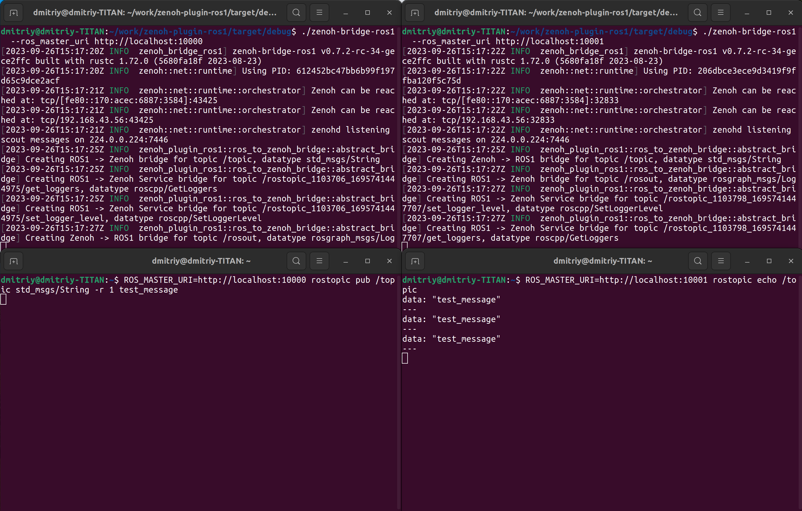

<!--- 
[](https://github.com/eclipse-zenoh/zenoh-plugin-ros1/actions?query=workflow%3ARust)
--->
[](https://github.com/eclipse-zenoh/roadmap/discussions)
[](https://discord.gg/2GJ958VuHs)
[](https://choosealicense.com/licenses/epl-2.0/)
[](https://opensource.org/licenses/Apache-2.0)

# Eclipse Zenoh

The Eclipse Zenoh: Zero Overhead Pub/sub, Store/Query and Compute.

Zenoh (pronounce _/zeno/_) unifies data in motion, data at rest and computations. It carefully blends traditional pub/sub with geo-distributed storages, queries and computations, while retaining a level of time and space efficiency that is well beyond any of the mainstream stacks.

Check the website [zenoh.io](http://zenoh.io) and the [roadmap](https://github.com/eclipse-zenoh/roadmap) for more detailed information.

-------------------------------

# ROS1 to Zenoh Bridge plugin

:point_right: **Install latest release:** see [below](#how-to-install-it)

:point_right: **Docker image:** see [below](#docker-image)

:point_right: **Build "main" branch:** see [below](#how-to-build-it)

## Background

ROS1 is a well-known mature platform for building robotic systems. Despite the fact that next generation of ROS - ROS2 is released long time ago, many developers still prefer using ROS1. In order to integrate ROS1 systems to Zenoh infrastructure, [as it was done for DDS/ROS2](https://github.com/eclipse-zenoh/zenoh-plugin-dds), ROS1 to Zenoh Bridge was designed.

## How to install it

To install the latest release of either the ROS1 plugin for the Zenoh router, either the `zenoh-bridge-ros1` standalone executable, you can do as follows:

### Manual installation (all platforms)

All release packages can be downloaded from:  

- [https://download.eclipse.org/zenoh/zenoh-plugin-ros1/latest/](https://download.eclipse.org/zenoh/zenoh-plugin-ros1/latest/)

Each subdirectory has the name of the Rust target. See the platforms each target corresponds to on [https://doc.rust-lang.org/stable/rustc/platform-support.html](https://doc.rust-lang.org/stable/rustc/platform-support.html)

Choose your platform and download:

- the `zenoh-plugin-ros1-<version>-<platform>.zip` file for the plugin.  
  Then unzip it in the same directory than `zenohd` or to any directory where it can find the plugin library (e.g. /usr/lib)
- the `zenoh-bridge-ros1-<version>-<platform>.zip` file for the standalone executable.  
  Then unzip it where you want, and run the extracted `zenoh-bridge-ros1` binary.

### Linux Debian

Add Eclipse Zenoh private repository to the sources list:

```bash
echo "deb [trusted=yes] https://download.eclipse.org/zenoh/debian-repo/ /" | sudo tee -a /etc/apt/sources.list > /dev/null
sudo apt update
```

Then either:

- install the plugin with: `sudo apt install zenoh-plugin-ros1`.
- install the standalone executable with: `sudo apt install zenoh-bridge-ros1`.

## How to build it

> :warning: **WARNING** :warning: : Zenoh and its ecosystem are under active development. When you build from git, make sure you also build from git any other Zenoh repository you plan to use (e.g. binding, plugin, backend, etc.). It may happen that some changes in git are not compatible with the most recent packaged Zenoh release (e.g. deb, docker, pip). We put particular effort in mantaining compatibility between the various git repositories in the Zenoh project.
>
> :warning: **WARNING** :warning: : As Rust doesn't have a stable ABI, the plugins should be
built with the exact same Rust version than `zenohd`, and using for `zenoh` dependency the same version (or commit number) than 'zenohd'.
Otherwise, incompatibilities in memory mapping of shared types between `zenohd` and the library can lead to a `"SIGSEV"` crash.
>
> :warning: **WARNING** :warning: : We failed to build the plugin's tests on the system with 2(1)GB of RAM(swap) as ld ran out of memory, please pay attention to this fact!

In order to build the ROS1 to Zenoh Bridge, you need first to install the following dependencies:

- [Rust](https://www.rust-lang.org/tools/install). If you already have the Rust toolchain installed, make sure it is up-to-date with:

   ```bash
   rustup update
   ```

- On Linux, make sure the `llvm` and `clang` development packages are installed:
  - on Debians do: `sudo apt install llvm-dev libclang-dev`
  - on CentOS or RHEL do: `sudo yum install llvm-devel clang-devel`
  - on Alpine do: `apk install llvm11-dev clang-dev`

Once these dependencies are in place, you may clone the repository on your machine:

```bash
git clone https://github.com/eclipse-zenoh/zenoh-plugin-ros1.git
cd zenoh-plugin-ros1
cargo build --release
```

The standalone executable binary `zenoh-bridge-ros1` and a plugin shared library (`*.so` on Linux, `*.dylib` on Mac OS, `*.dll` on Windows) to be dynamically
loaded by the zenoh router `zenohd` will be generated in the `target/release` subdirectory.

## Docker image

The **`zenoh-bridge-ros1`** standalone executable is also available as a [Docker images](https://hub.docker.com/r/eclipse/zenoh-bridge-ros1/tags?page=1&ordering=last_updated) for both amd64 and arm64. To get it, do:

- `docker pull eclipse/zenoh-bridge-ros1:latest` for the latest release
- `docker pull eclipse/zenoh-bridge-ros1:main` for the main branch version (nightly build)

Usage: **`docker run --init --net host eclipse/zenoh-bridge-ros1`**  
It supports the same command line arguments than the `zenoh-bridge-ros1` (see below or check with `-h` argument).

## A quick test with built-in examples

If you want to run examples or tests, you need to install ROS1:

```bash
sudo apt install -y ros-base
```

There is a set of example utilities illustarating bridge in operation.
Here is a description on how to configure the following schema:

```raw
_____________________________                           ________________________________
|                           |                           |                              |
|        rosmaster_1        |                           |         rosmaster_2          |
|                           |                           |                              |
| ros1_publisher -> zenoh-bridge-ros1 -> zenoh -> zenoh-bridge-ros1 -> ros1_subscriber |
|___________________________|                           |______________________________|
```

```bash
# build the bridge from source
cargo build -p zenoh-bridge-ros1
cd target/debug/
# terminal 1:
./zenoh-bridge-ros1 --with_rosmaster true --ros_master_uri http://localhost:10000
# terminal 2:
./zenoh-bridge-ros1 --with_rosmaster true --ros_master_uri http://localhost:10001
# terminal 3:
ROS_MASTER_URI=http://localhost:10000 rostopic pub /topic std_msgs/String -r 1 test_message
# terminal 4:
ROS_MASTER_URI=http://localhost:10001 rostopic echo /topic
```

Once completed, you will see the following exchange between ROS1 publisher and subscriber:


## Implementation

Currently, ROS1 to Zenoh Bridge is based on [rosrust library fork](https://github.com/ZettaScaleLabs/rosrust). Some limitations are applied due to rosrust's implementation details, and we are re-engineering rosrust to overcome this

## Limitations

- all topic names are bridged as-is
- there is a performance impact coming from rosrust
