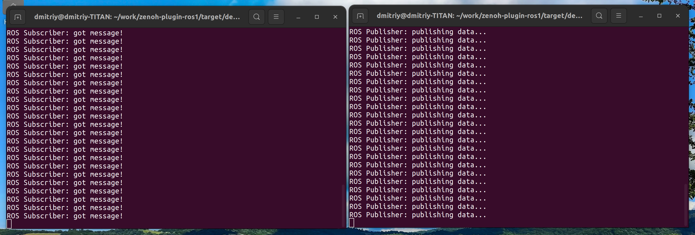

<!--- 
[](https://github.com/eclipse-zenoh/zenoh-plugin-ros1/actions?query=workflow%3ARust)
--->
[](https://github.com/eclipse-zenoh/roadmap/discussions)
[](https://discord.gg/2GJ958VuHs)
[](https://choosealicense.com/licenses/epl-2.0/)
[](https://opensource.org/licenses/Apache-2.0)

# Eclipse Zenoh
The Eclipse Zenoh: Zero Overhead Pub/sub, Store/Query and Compute.

Zenoh (pronounce _/zeno/_) unifies data in motion, data at rest and computations. It carefully blends traditional pub/sub with geo-distributed storages, queries and computations, while retaining a level of time and space efficiency that is well beyond any of the mainstream stacks.

Check the website [zenoh.io](http://zenoh.io) and the [roadmap](https://github.com/eclipse-zenoh/roadmap) for more detailed information.

-------------------------------
# ROS1 to Zenoh Bridge plugin

## Background
ROS1 is a well-known mature platform for building robotic systems. Despite the fact that next generation of ROS - ROS2 is released long time ago, many developers still prefer using ROS1. In order to integrate ROS1 systems to Zenoh infrastructure, [as it was done for DDS/ROS2](https://github.com/eclipse-zenoh/zenoh-plugin-dds), ROS1 to Zenoh Bridge was designed.

## How to install it
Currently, only out-of-source build is supported.

## How to build it

> :warning: **WARNING** :warning: : Zenoh and its ecosystem are under active development. When you build from git, make sure you also build from git any other Zenoh repository you plan to use (e.g. binding, plugin, backend, etc.). It may happen that some changes in git are not compatible with the most recent packaged Zenoh release (e.g. deb, docker, pip). We put particular effort in mantaining compatibility between the various git repositories in the Zenoh project.

> :warning: **WARNING** :warning: : As Rust doesn't have a stable ABI, the plugins should be
built with the exact same Rust version than `zenohd`, and using for `zenoh` dependency the same version (or commit number) than 'zenohd'.
Otherwise, incompatibilities in memory mapping of shared types between `zenohd` and the library can lead to a `"SIGSEV"` crash.

> :warning: **WARNING** :warning: : We failed to build the plugin's tests on the system with 2(1)GB of RAM(swap) as ld ran out of memory, please pay attention to this fact!

In order to build the ROS1 to Zenoh Bridge, you need first to install the following dependencies:

- [Rust](https://www.rust-lang.org/tools/install)
- On Linux, make sure the `llvm` and `clang` development packages are installed:
   - on Debians do: `sudo apt install llvm-dev libclang-dev`
   - on CentOS or RHEL do: `sudo yum install llvm-devel clang-devel`
   - on Alpine do: `apk install llvm11-dev clang-dev`

Once these dependencies are in place, you may clone the repository on your machine:

```bash
$ git clone https://github.com/eclipse-zenoh/zenoh-plugin-ros1.git
$ cd zenoh-plugin-ros1
```

> :warning: **WARNING** :warning: : On Linux, don't use `cargo build` command without specifying a package with `-p`. Building both `zenoh-plugin-ros1` (plugin library) and `zenoh-bridge-ros1` (standalone executable) together will lead to a `multiple definition of `load_plugin'` error at link time. See [#117](https://github.com/eclipse-zenoh/zenoh-plugin-dds/issues/117#issuecomment-1439694331) for explanations.

You can then choose between building the zenoh bridge for ROS1:
- as a plugin library that can be dynamically loaded by the zenoh router (`zenohd`):
```bash
$ cargo build --release -p zenoh-plugin-ros1
```
The plugin shared library (`*.so` on Linux, `*.dylib` on Mac OS, `*.dll` on Windows) will be generated in the `target/release` subdirectory.

- or as a standalone executable binary:
```bash
$ cargo build --release -p zenoh-bridge-ros1
```
The **`zenoh-bridge-ros1`** binary will be generated in the `target/release` sub-directory.


## A quick test with built-in examples

If you want to run examples or tests, you need to install ROS1:
```bash
$ sudo apt install -y ros-base
```

There is a set of example utilities illustarating bridge in operation.
Here is a description on how to configure the following schema:
```
_____________________________                               ________________________________
|                           |                               |                              |
|        rosmaster_1        |                               |         rosmaster_2          |
|                           |                               |                              |
| ros1_publisher -> ros_to_zenoh_bridge -> zenoh -> ros_to_zenoh_bridge -> ros1_subscriber |
|___________________________|                               |______________________________|
```

1. Build everything:
```bash
$ cargo build --release -p zenoh-bridge-ros1
$ cargo test --release --no-run
```
There are three executables we'll need:
```
target/release/zenoh-bridge-ros1             // bridge executable
target/release/examples/ros1_standalone_sub  // ros1 test subscriber
target/release/examples/ros1_standalone_pub  // ros1 test publisher
```

2. Start first bridge together with rosmaster_1:
```bash
$ ./target/release/zenoh-bridge-ros1 --with_rosmaster true --ros_master_uri http://localhost:10000
```
At this step we start ROS1 master together with bridge isolated on port 10000 

3. Start second bridge together with rosmaster_2:
```bash
$ ./target/release/zenoh-bridge-ros1 --with_rosmaster true --ros_master_uri http://localhost:10001
```
At this step we start ROS1 master together with bridge isolated on port 10001

4. Start ros1_subscriber:
```bash
$ ROS_MASTER_URI=http://localhost:10000 ./target/release/examples/ros1_standalone_sub
```
The subscriber will work with ROS1 isolated on port 10000

5. Start ros1_publisher:
```bash
$ ROS_MASTER_URI=http://localhost:10001 ./target/release/examples/ros1_standalone_pub
```
The publisher will work with ROS1 isolated on port 10001

Once completed, you will see the following exchange between ROS1 publisher and subscriber:



## Implementation
Currently, ROS1 to Zenoh Bridge is based on [rosrust library fork](https://github.com/ZettaScaleLabs/rosrust). Some limitations are applied due to rosrust's implementation details, and we are targeting to re-engineer rosrust to overcome this

## Limitations
- all topic names are bridged as-is
- all topic datatypes and md5 sums are bridged as "*" wildcard and may not work with some ROS1 client implementations
- there is a performance impact coming from rosrust

